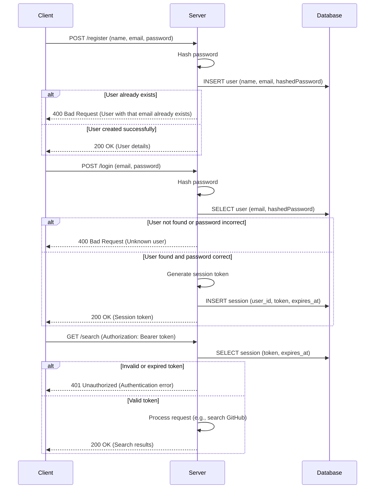

# Example code for implementing Register and Login in Cloudflare Workers using D1

This project provides a practical example of implementing user registration and login functionality within a Cloudflare Workers environment, utilizing D1 for database storage. It demonstrates common authentication patterns, including password hashing and session token management, and serves as a companion to the [accompanying article](https://massadas.com/posts/implementing-register-and-login-in-workers-d1/).

Technologies used:
- [hono](https://github.com/honojs/hono): A small, simple, and ultrafast web framework for the Edge, used here for routing.
- [chanfana](https://github.com/cloudflare/chanfana): Employed for OpenAPI specification generation and request/response validation, ensuring API integrity.
- [workers-qb](https://github.com/G4brym/workers-qb): A query builder for Cloudflare D1, simplifying database interactions.

## Getting started with this project

### Prerequisites
Before you begin, ensure you have the following installed:
- Node.js (v16 or later)
- npm (comes with Node.js)
- Wrangler CLI (Cloudflare's command-line tool for Workers)

If you don't have Wrangler installed, you can install it globally via npm:
```bash
npm install -g wrangler
```
You'll also need a Cloudflare account.

Install the dependencies

```bash
npm install
```

Create a new D1 database (replace `<your-db-name>` with a name of your choice):

```bash
wrangler d1 create <your-db-name>
```

Copy the `database_id` and place it in the `wrangler.toml` file

```toml
[[d1_databases]]
binding = "DB"
database_name = "<your-db-name>"
database_id = "<your-db-id>"
```

Apply initial migrations. These scripts set up the `users` and `users_sessions` tables required for storing user credentials and session information:

```bash
# Remote development
wrangler d1 migrations apply DB --remote

# Local development
wrangler d1 migrations apply DB --local
```

Start the project

```bash
npm run serve
```

Now open your browser at [http://localhost:8787/](http://localhost:8787/)

## Project Structure
A brief overview of important files and directories:
- `src/`: Contains the core application code.
    - `endpoints/`: Defines the API route handlers.
    - `foundation/`: Includes foundational code like authentication logic (`auth.ts`).
    - `index.ts`: The entry point for the Worker, setting up routes.
    - `types.d.ts`: TypeScript type definitions.
- `migrations/`: SQL files for D1 database migrations.
- `wrangler.toml`: Configuration file for Cloudflare Workers, including D1 database bindings.
- `package.json`: Project dependencies and scripts.
- `README.md`: This file, providing information about the project.

## Available Endpoints
This example application exposes the following API endpoints:
- `POST /register`: Allows new users to register. Requires `name`, `email`, and `password` in the request body.
- `POST /login`: Allows existing users to log in. Requires `email` and `password` in the request body. Returns a session token.
- `GET /search`: An example protected endpoint that requires a valid Bearer token (obtained from login) in the `Authorization` header. It searches GitHub repositories based on a query parameter `q`.

The authentication logic (registration, login, and token validation) is detailed in the 'Authentication Flow' diagram below.

## Authentication Flow



## License
This project is licensed under the MIT License. See the [LICENSE](LICENSE) file for details.

## Screenshots

Swagger interface: Demonstrates the auto-generated API documentation via Chanfana, showing available endpoints.


Unauthenticated: Example of an error response when trying to access a protected endpoint without valid authentication.


Authentication: Shows a successful login response, including the session token.


Endpoint results: An example of successfully accessing a protected endpoint (`/search`) after authenticating.

